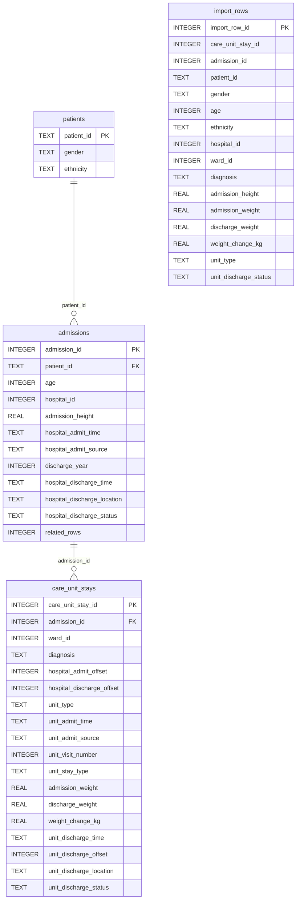
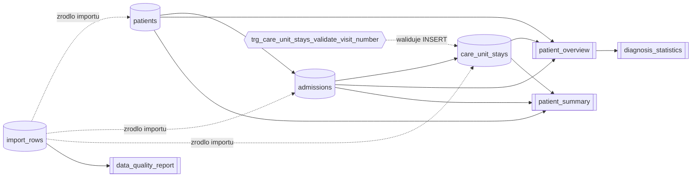

# Wizualizacja schematu bazy danych

Ponizsze diagramy opisuja aktualny schemat z `database/schema.sql` i odpowiadaja obiektom znalezionym w `ehr_app.db`.

## ERD tabel

## Widoki i logika bazy

## Najwazniejsze relacje

- `patients (1) -> (N) admissions`
- `admissions (1) -> (N) care_unit_stays`
- `import_rows` jest tabela stagingowa do importu CSV i nie ma zdefiniowanych kluczy obcych
- `patient_overview` laczy `patients`, `admissions` i `care_unit_stays` przez `INNER JOIN`
- `patient_summary` agreguje dane na poziomie pacjenta przez `LEFT JOIN`
- `diagnosis_statistics` liczy statystyki na podstawie `patient_overview`
- `data_quality_report` raportuje braki danych w `import_rows`
- trigger `trg_care_unit_stays_validate_visit_number` blokuje zapis, gdy `unit_visit_number < 1`

## Uwagi

- Diagram ERD pokazuje glowne kolumny i klucze. Pelna definicja wszystkich pol jest w `database/schema.sql`.
- Linie przerywane oznaczaja zaleznosci logiczne lub przeplyw danych, a nie klucze obce wymuszane przez SQLite.
